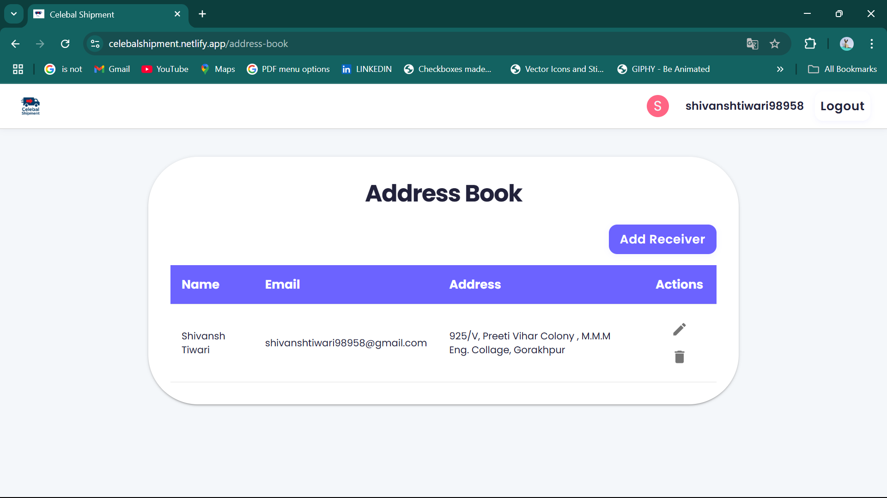

# Celebal Technologies CSI'25 Summer Internship Final Project

## Shipment Delivery Application


---

### About Celebal Technologies
Celebal Technologies is a leading provider of innovative technology solutions, specializing in Data, AI, and Cloud. The company is known for its vibrant work culture, focus on learning, and commitment to nurturing young talent through its internship programs.

#### CSI'25 Program
The Celebal Summer Internship (CSI'25) is a flagship program designed to provide students with hands-on experience in real-world projects, mentorship from industry experts, and opportunities to develop both technical and professional skills. The program is highly competitive and aims to shape the next generation of tech leaders.

---

## Project Overview
This Shipment Delivery Application was developed as my final project during the Celebal Technologies Summer Internship 2025 (CSI'25) program. The application streamlines the process of creating, tracking, and managing shipments, providing a seamless experience for users, admins, and delivery agents.

### Key Features
- **User Authentication:** Secure sign-up and login functionality.
- **Create Shipments:** Users can create new shipments, upload documents, and calculate delivery charges dynamically.
- **Bulk Upload:** Supports bulk shipment creation via CSV upload.
- **Dashboard:** View and manage all shipments, with advanced status updates (Dispatched, In Transit, Delivered, Returned, Cancelled).
- **Shipment Tracking:** Track shipments using tracking numbers, QR codes, or barcodes.
- **Status Updates:** Both sender and receiver can update shipment status with full history tracking.
- **Comments & Feedback:** Add comments to shipments and provide feedback after delivery.
- **Admin & Agent Panels:** Dedicated panels for admins and delivery agents for role-based management.
- **Address Book:** Manage frequently used addresses for quick shipment creation.
- **Notifications:** Real-time notifications for important actions and status changes.
- **Document Upload:** Attach PDFs or images to shipments for verification.
- **Modern UI:** Built with React, Material UI, and Vite for a fast, responsive experience.

---

## Screenshots

### 1. Login Page


### 2. Dashboard


### 3. Create Shipment


### 4. Your Shipments


### 5. Address Book


> _**Note:** Please add the above screenshots in the `src/assets/` directory with the specified filenames for them to appear in the README._

---

## Tech Stack
- **Frontend:** React, Vite, Material UI
- **Backend:** Firebase (Authentication, Firestore, Storage)
- **Payments:** Razorpay Integration
- **Deployment:** Netlify

---

## Getting Started

### Prerequisites
- Node.js (v16 or above)
- npm or yarn

### Installation
```bash
# Clone the repository
git clone <your-repo-url>
cd shipment-app

# Install dependencies
npm install
# or
yarn install

# Start the development server
npm run dev
# or
yarn dev
```

### Environment Variables
Create a `.env` file in the root directory and add your Firebase and Razorpay credentials as shown in `src/firebase.js` and `.env.example` (if available).

---

## Deployment
This project is deployed on Netlify:

🔗 [https://celebalshipment.netlify.app/](https://celebalshipment.netlify.app/)

---

## Acknowledgements
- **Celebal Technologies** for the opportunity and mentorship.
- **CSI'25 Program** for providing a platform to learn and grow.
- All mentors, peers, and contributors who supported this project.

---

## License
This project is for educational and demonstration purposes as part of the Celebal Technologies CSI'25 Internship Program.

---

## Footer

---

© 2025 [Celebal Technologies](https://www.celebaltech.com/)  
Developed as part of the Celebal Summer Internship CSI'25 Program  
Deployed at: [https://celebalshipment.netlify.app/](https://celebalshipment.netlify.app/)  

For queries or support, contact: **info@celebaltech.com**  

Connect with us:
- [Website](https://www.celebaltech.com/)
- [LinkedIn](https://www.linkedin.com/company/celebal-technologies/)
- [Twitter](https://twitter.com/celebaltech)

---
